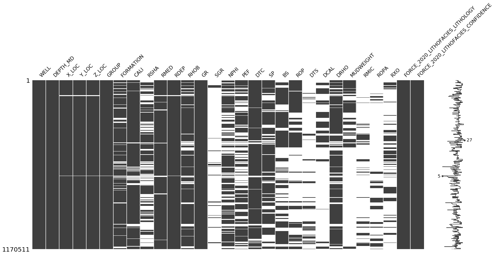
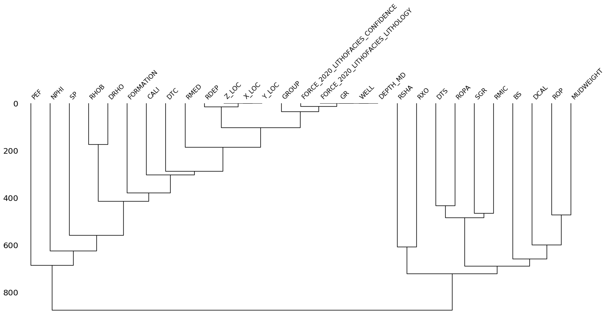
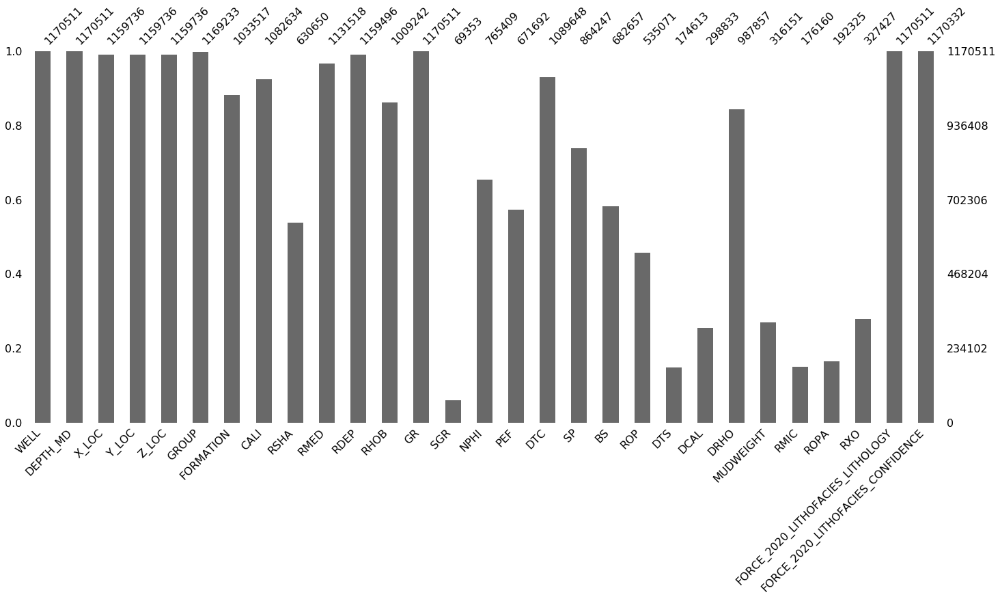
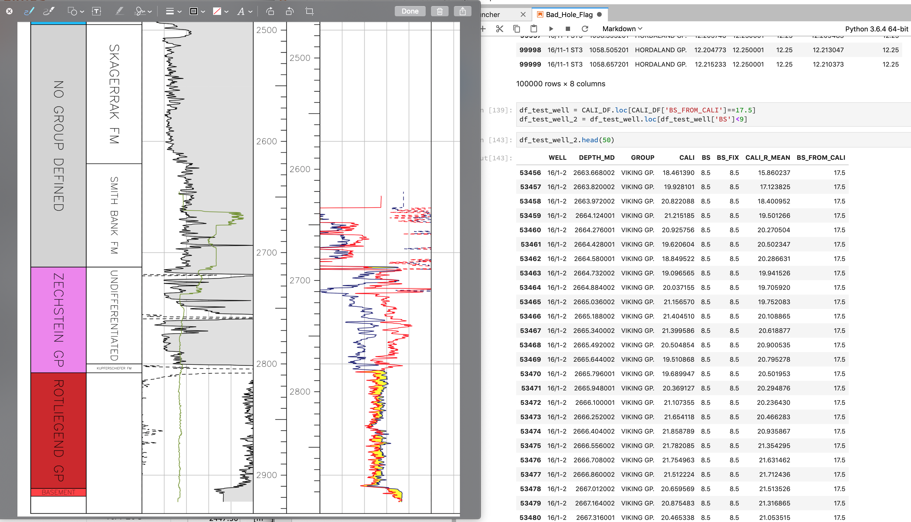
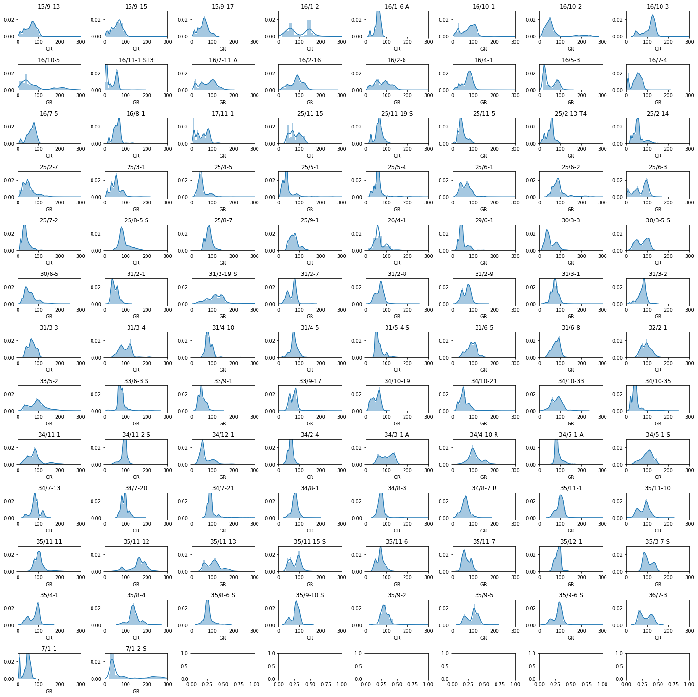

# Useful References

https://www.npd.no/en/facts/wells/

# Steps to look at
- Re-encode the number for the lithology key
    - First convert the numbers to 1 - x
    - Consider One Hot Encoding

- Look at bad hole conditions
    - Create a badhole flag based on DIFFCAL & DRHO
    - Attempt auto outlier detection if time

- Consider normalising gamma ray and pef
    - GR data is not normalised

- Consider strategies for filling missing data
    - Setup multiple MLR scenarios to fill in missing data
        - DT = RHOB, GR, NPHI
        - RHOB = DT, GR, NPHI
        - NPHI = DT, GR, RHOB
        - GR = DT, RHOB, NPHI
    - Where only one curve is present, most likely GR, then we can consider mean imputation from the intervals or depth


# Missing Data Extent
Curves with the most missing values:
- SGR
- DTS
- DCAL
- RMIC
- Mudweight
- ROPA
- RSHA
- RXO







This leaves us with:
- DEPT **Always present**
- CALI
- RDEP (Deep Res)
- RHOB
- DHRO 
- GR **Always present**
- RMED (Med Res)
- NPHI
- PEF
- DTC
- SP
- BS
- X_LOC
- Y_LOC
- Z_LOC (TVDSS)
- Formation

# Identifying Bad Hole Conditions

Caliper and DRHO logs can be used as bad hole indicators. Usually to identify badhole conditions you create a DIFCAL, which if it exceeds a certain value, you can flag it as bad hole.

In this dataset, Bitsize is incomplete and shows erroneous values. Therefore a synthetic BS curve has been created in multiple steps:

1. Existing bitsize curve is normalised to standard hole sizes
2. Using a rolling mean, the closest bitsize is adopted, however, in excessive washed out intervals an incorrect bitsize is calculated. See the image below
3. Standardised bitsize takes precendence and mean from caliper is added onto it



# Well Normalisation
Assuming a single dataframe with multiple well.

Reference: https://rsenergy.azurewebsites.net/experience-rs/market-news/blog/wireline-log-normalization

```python
def normalise(low, high, curve, well_low, well_high):
    norm = low + ((high - low) * ((curve - well_low) / (well_high - well_low)))
    return norm
    
#Create the percentile columns:
percentile_95 = df_gr.groupby('WELL')['GR'].quantile(0.95)
df_gr['95_PERC'] = df_gr['WELL'].map(percentile_95)
percentile_05 = df_gr.groupby('WELL')['GR'].quantile(0.05)
df_gr['05_PERC'] = df_gr['WELL'].map(percentile_05)

# Key well: 
key_well_low = 31.185694
key_well_high = 174.556263

#Apply to the dataframe
df_gr['GR_NORM'] = df_gr.apply(lambda x: normalise(key_well_low, key_well_high, x['GR'], x['05_PERC'], x['95_PERC']), axis=1)
```

```python
fig,ax = plt.subplots(figsize=(10,10))

well_gr_groups = df_gr.groupby('WELL')

for name, well in well_gr_groups:
    well.GR_NORM.plot(kind='kde', ax=ax)

plt.xlim(0, 300)
plt.show()
```

When all GR curves are plotted on top of each other the plot becomes very difficult to interpret, even after normalisation. The following code can generate a multi-faceted plot where you can view all of the data from all wells at once

```python
fig, axs = plt.subplots(nrows, 8, figsize=(20,20))
for (name, df), ax in zip(grouped, axs.flat):
    sns.distplot(df['GR'], ax=ax)
    ax.set_xlim(0,300)
    ax.set_ylim(0,0.03)
    ax.set_title(name)
plt.tight_layout()
```

)

When vieiwing the lithology crossplots, a number of values for GR are in excess of 500, which could be bad data or potentially hot shales.

Number of points:
>500 : 72  
>300 : 960

- [x] Could be converted into a nice function where the user passes in the percentile values, key values and dataframe

# Potential ML Models

- XGBOOST
- Neural Network

# Scoring

- Use `<br>` to add a line break in the markdown
- Test Score: XEEK Score using train_test_split (70/30)
- Accuracy: from accuracy_score
- KFOLD Accuracy: Stratified Kfold cross-validation

| Model | Date       | Submitted | Submission | Description                                                  | ML Model | Inputs                                                            | Test Score | Accuracy | KFOLD Accuracy (Splits) | Open Test Score | Rank    |
|-------|------------|-----------|------------|--------------------------------------------------------------|----------|-------------------------------------------------------------------|------------|----------|-------------------------|-----------------|---------|
| 1     | 14/09/2020 | Y         | 1          | Model with VShale, Fixed RHOB and BitSize                    | XGBoost  | VSHALE, RHOB_FIX, DTC, TVD                                        | -0.51681   |          |                         | -0.7166         | 37 / 52 |
| 2     | 15/09/2020 | Y         | 2          | Model with VShale, DEPTH_MD, RHOB, DTC after refactored code | XGBoost  | VSHALE, RHOB, DTC, DEPTH_MD                                       | -0.50806   | 80.7933  |                         | -0.6992         | 36 / 53 |
| 3     | 15/09/2020 | N         |            | Added Scaler                                                 | XGBoost  | VSHALE, RHOB, DTC, DEPTH_MD                                       | -0.50666   | 80.85797 |                         | --              |         |
| 4     | 15/09/2020 | Y         | 3          | Added RDEP                                                   | XGBoost  | VSHALE, RHOB, DTC, DEPTH_MD, RDEP                                 | -0.43384   | 83.5223  |                         | -0.8262         |         |
| 5     | 15/09/2020 | N         |            | Replaced Depth with TVD                                      | XGBoost  | VSHALE, RHOB, DTC, TVD, RDEP                                      | -0.43222   | 83.5889  |                         | --              |         |
| 6     | 15/09/2020 | Y         | 4          | Added in unedited NPHI and PEF                               | XGBoost  | VSHALE, RHOB, DTC, TVD, RDEP, NPHI, PEF                           | -0.36345   | 86.1724  |                         | -0.7526         |         |
| 7     | 15/09/2020 | Y         | 5          | Added dummy variables for GROUP                              | XGBoost  | VSHALE, RHOB, DTC, TVD, RDEP, NPHI, PEF, GROUPS                   | -0.313418  | 88.0357  | 60.72417, 7.07667 (5)   | -0.7093         | 36 / 53 |
| 8     | 16/09/2020 | N         |            | Combined RHOB with RFR derived RHOB in badhole and nulls     | XGBoost  | VSHALE, RHOB_COMBINED, DTC, TVD, RDEP, NPHI, PEF, GROUPS          | -0.56580   | 78.2768  | 69.86007, 1.66264 (3)   | --              |         |
| 9     | 16/09/2020 | Y         | 6          | Fixed NPHI and included synthetic data in badhole conditions | XGBoost  | VSHALE, RHOB_COMBINED, NPHI_COMBINED, DTC, TVD, RDEP, PEF, GROUPS | -0.57352   | 77.9561  | 69.52176, 1.75301 (3)   | -0.5894         | 20 / 56 |